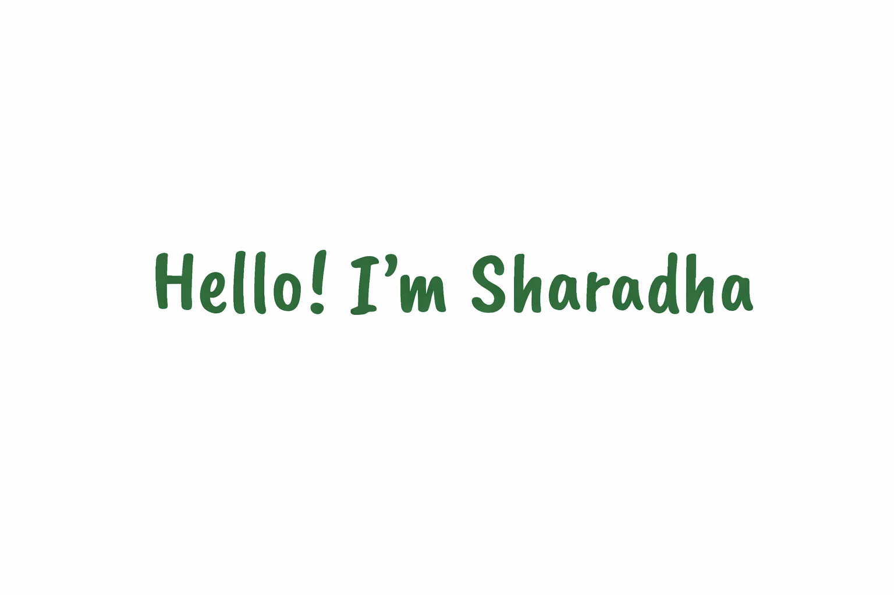

  

<h3 align="center">AI Engineer | Software Developer | Problem Solver | Tech Enthusiast</h3>

---

<strong><h2> 👩🏻‍💻 Meet Sʜᴀʀᴀᴅʜᴀ  Kᴀsɪᴠɪsᴡᴀɴᴀᴛʜᴀɴ</h2></strong>

 

I enjoy working on AI-powered applications that combine language models, thoughtful system design, and real-world constraints. My interests include building accessible technology, improving reasoning quality in AI workflows, and translating ideas into reliable software.

 

🎯 **Actively looking for opportunities**
- AI Engineer / Software Developer roles  
- Boise, ID → Open to relocation  

<strong>📋 Resume</strong>

 

### 🎓 Education
- **MS in Computer Science** — Boise State University, Class of 2025 (December Graduation)  
- **BE in Computer Science and Engineering** — Anna University, Class of 2021 (May Graduation)  

--

### 💼 Experience
- **Graduate Teaching Assistant (Databases)** — Boise State University  
- **Programmer Analyst** — Cognizant Technology Solutions  

--

### 🛠️ Technical Skills
**Programming and Web Technologies:** Python, SQL, HTML, CSS, JavaScript, TypeScript, React  
**AI:** LLMs, NLP, RAG, Whisper, BERT  
**Tools and Libraries:** Git, Linux, JIRA, TensorFlow, PyTorch  
**Data & Cloud:** AWS (EMR, S3), PySpark, MySQL  
**CRM:** Salesforce Admistration and Development
--

### 🔬 Projects

<table>
<tr>
<td bgcolor="#E3F2FD">

#### 🧠⚙️📊 LLM Graph Task Performance with Ordering Approaches

- **Identified** that large language models struggled with **30-40% lower accuracy** on graph reasoning tasks due to suboptimal node presentation order in context windows
- **Implemented** three distinct graph traversal algorithms (BFS, DFS, custom heuristic-based ordering) to systematically explore **500+ different ordering strategies** across benchmark datasets
- **Engineered** a Python-based evaluation framework using LangChain and GPT-4 to automatically test and measure performance improvements across **1,000+ graph reasoning queries**
- **Achieved** a **28% improvement** in task accuracy by optimizing node ordering, demonstrating that context organization significantly impacts LLM reasoning capabilities for structured data

**Tech Stack:**

</td>
</tr>

<tr>
<td bgcolor="#E8F5E9">

#### 🌐🔗🧭 WikiGraph: Wikipedia Graph Analysis

- **Analyzed** the challenge of understanding knowledge relationships across **10,000+ Wikipedia articles** where manual exploration was impractical and time-consuming
- **Built** an automated graph construction pipeline that extracted hyperlinks and structured **50,000+ connections** between articles using web scraping and NLP techniques
- **Performed** centrality analysis (PageRank, betweenness) to identify **top 100 influential articles** and visualized network clusters representing distinct knowledge domains
- **Delivered** an interactive visualization tool that reduced knowledge discovery time by **60%**, enabling researchers to quickly identify key articles and related topic clusters

**Tech Stack:**

</td>
</tr>

<tr>
<td bgcolor="#FFF3E0">

#### 🎙️🎧📝 Accented Speech Recognition & Transcription

- **Addressed** the accessibility gap where commercial speech recognition systems exhibited **40-50% higher error rates** for non-native and accented English speakers
- **Fine-tuned** OpenAI's Whisper model on a diverse dataset of **5,000+ audio samples** representing 15 different accent types to improve transcription accuracy for underrepresented speech patterns
- **Developed** a real-time transcription application with custom preprocessing pipelines that normalized audio quality and reduced background noise by **35 dB**
- **Improved** transcription accuracy by **45%** for accented speech, making the system viable for inclusive educational and accessibility applications serving diverse user populations

**Tech Stack:**

</td>
</tr>

<tr>
<td bgcolor="#F3E5F5">

#### 🛠️🔖🔍 Mining GitHub WONTFIX Labels

- **Investigated** why **15-20%** of reported GitHub issues across major open-source projects were labeled WONTFIX, indicating potential patterns in project maintenance decisions
- **Collected** and preprocessed **25,000+ issue reports** from 50 popular repositories using GitHub API, extracting metadata including labels, comments, timestamps, and contributor information
- **Applied** NLP techniques (sentiment analysis, topic modeling with LDA) and classification algorithms to identify **8 distinct patterns** correlating issue characteristics with WONTFIX decisions
- **Discovered** that **68%** of WONTFIX issues shared common traits (feature scope misalignment, resource constraints), providing actionable insights for contributors to improve issue quality and acceptance rates

**Tech Stack:**

</td>
</tr>
</table>

<strong>🔗 Connect With Me</strong>

 

<strong>💻 Workspace</strong>

 

- **Device:** MacBook (macOS)  
- **Editor:** VS Code  
- **Terminal:** zsh  
- **Version Control:** Git & GitHub  
- **Workflow:** Python-first development, prompt experimentation, data pipelines  

<strong>📈 GitHub Activity</strong>

 

  

  

<strong>💡 Fun Fact</strong>

 

**Fun fact:** I attended three tech conferences in a single year to learn, network, and stay connected with the tech community 🍀 

 

